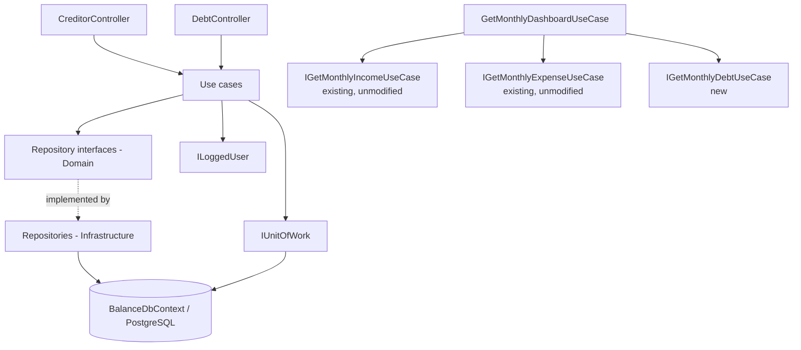
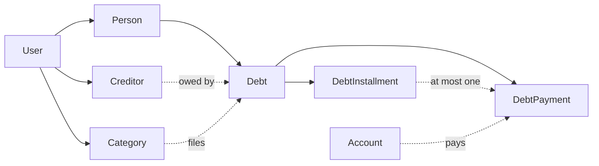

# Debt Tracking Design

**Spec**: `.specs/features/debt-tracking/spec.md`
**Status**: Awaiting approval

A vertical slice over the existing Clean Architecture layers. Four new entities, two new controllers,
one new composition point on the dashboard. No expense or income file changes behaviour.

---

## Approach exploration

### Why a debt is not an installment plan

`InstallmentPlan` generates `Expense` rows: facts that already happened, on a required `AccountId`,
always `ExpenseType.Credit`, with no expected-versus-actual and no status. A debt installment is the
opposite - an obligation that has not happened yet, whose payment method is unknown until the day it
is paid. Reusing `Expense` for it would mean writing rows that represent money which has not left,
and every `Sum(Amount)` in the expense module would start counting future obligations as spend.

The shape a debt actually needs already exists in this codebase: `RecurringExpense` →
`RecurringExpenseVersion` (expectation) → `RecurringExpensePayment` (fact), with
`ResolveStatus(expected, actual)` deriving `Pending` / `Paid` / `Divergent`. `Debt` →
`DebtInstallment` → `DebtPayment` is that anatomy with a fixed end instead of an open one.

### Why the schedule is not built by `CompetenceMonthResolver`

`CompetenceMonthResolver` answers "which invoice does this card purchase land on", using
`Account.ClosingDay`. A debt has no account and no closing day; it has a `DueDay`. Calling the
resolver here would silently apply a credit-card rule to a bank loan. A separate
`DebtScheduleBuilder` owns the debt rule, and the two never meet.

### Why the outstanding balance is derived

Three candidate designs: a persisted `OutstandingBalance` updated on every payment; a persisted
balance plus a reconciliation job; or a computed value. The first drifts the first time
`UpdateDebtPayment` corrects an amount and the update path forgets to re-subtract. The second is
infrastructure this application does not have. The third costs one `Sum` over a collection that is
already `Include`d for the response, and cannot disagree with its own payments. Settled state is
derived from it for the same reason - and lesson **L-002** already records what shipping a flag with
nothing to set it costs.

### Why the month's debts hang off the dashboard, not off the expense response

The spec's block-in-the-month requirement can be met in two places. Inside
`ResponseMonthlyExpenseJson` it would force `GetMonthlyExpenseUseCase` to inject
`IDebtReadOnlyRepository`, making the expense module depend on debts and putting a debt regression
one edit away from breaking every expense test. At the dashboard it is pure composition - exactly the
pattern AD-006 established for income. The dashboard grows a third dependency and nothing else
changes.

### Migration strategy

One additive migration, `AddDebtTracking`. Four new tables, no column on an existing table is added,
altered or dropped, so committed history and the `AddExpenseTracking` migration stay intact.

---

## Architecture Overview



Ownership, per AD-002, AD-003 and AD-005:



`Creditor` hangs off `User` directly - the household shares one catalogue of who it owes, exactly as
it shares one catalogue of categories. `Debt` cascades through `Person`, so every debt read filters
on `Person.UserId`. A payment's `Account` is checked independently against the logged user, so a debt
of person A may legitimately be paid on person B's card.

The two references on `Debt` answer different questions and neither substitutes for the other:
`PersonId` is *who in the household owes it*, `CreditorId` is *who is owed*.

---

## Code Reuse Analysis

### Existing Components to Leverage

| Component | Location | How to Use |
| --------- | -------- | ---------- |
| `BaseEntity` | `src/Balance.Domain/Entities/BaseEntity.cs` | Every new entity inherits it; `StampAuditFields` already covers them |
| `ILoggedUser` | `src/Balance.Domain/Services/LoggedUser/ILoggedUser.cs` | Ownership root for every new query |
| `IUnitOfWork` | `src/Balance.Domain/Repositories/IUnitOfWork.cs` | One `Commit()` per use case gives DEBT-01's transactional guarantee |
| `ExceptionFilter` | `src/Balance.Api/Filters/ExceptionFilter.cs` | Maps `ErrorOnValidationException` → 400, `NotFoundException` → 404; no try/catch in controllers |
| `ResourceErrorMessages` + `.resx` pair | `src/Balance.Exception/` | Four new keys; seven existing keys reused verbatim |
| `ACCOUNT_REQUIRED_FOR_CREDIT` | `src/Balance.Exception/ResourceErrorMessages.resx` | Reused as-is for DPAY-04; the rule already shipped for `Expense` on this branch |
| `DateOnly.FirstDayOfMonth()` | `src/Balance.Domain/Extensions/IncomeSourceExtensions.cs` | Called, not edited |
| Installment rounding | `src/Balance.Application/UseCases/Expenses/RegisterInstallmentPlan/RegisterInstallmentPlanUseCase.cs:113` | **Extracted** into `InstallmentAmountCalculator` and called by both. See Tech Decisions |
| `ResolveStatus` shape | `src/Balance.Application/UseCases/Expenses/GetMonthly/GetMonthlyExpenseUseCase.cs:118` | Same three-branch rule, reimplemented in the debt view. Extraction would mean editing the expense use case for a debt's benefit |
| `ExpenseType` / `ExpenseStatus` enums | `src/Balance.Domain/Enums/` and `src/Balance.Communication/Enums/` | Reused unchanged. Neither gains a member |
| `GetMonthlyDashboardUseCase` | `src/Balance.Application/UseCases/Dashboard/GetMonthly/` | Gains one constructor dependency and one response property. Its composition-only character is preserved |
| Repository read/write split | `src/Balance.Domain/Repositories/RecurringExpenses/` | Same interface shape for the debt aggregate |
| Validator pattern | `src/Balance.Application/UseCases/Expenses/RegisterInstallmentPlan/RegisterInstallmentPlanValidator.cs` | FluentValidation `AbstractValidator<TRequest>` per use case |
| Test builders | `tests/CommonTestUtilities/` | New builders follow `RecurringExpenseBuilder` and its request-builder sibling |
| `CustomWebApplicationFactory` | `tests/WebApi.Test/CustomWebApplicationFactory.cs` | Extended with debt seed data; existing seeds untouched |

### Integration Points

| System | Integration Method |
| ------ | ------------------ |
| Income | None. No debt type references an income type |
| Expenses | One-way and structural only: `InstallmentAmountCalculator` is extracted from `RegisterInstallmentPlanUseCase`, whose behaviour and tests are unchanged. No expense use case gains a debt dependency |
| Dashboard | `GetMonthlyDashboardUseCase` injects `IGetMonthlyDebtUseCase` and calls it. Composition only |
| PostgreSQL | Four new tables in one additive migration, `AddDebtTracking` |
| Swagger | Two new controllers inherit the existing Bearer configuration |

---

## Components

### Enums

**Location**: `src/Balance.Domain/Enums/`, mirrored member-for-member in
`src/Balance.Communication/Enums/` so the existing `(CommunicationX)domainX` cast convention holds.

- `CreditorType { Person = 0, Institution = 1, Other = 2 }`
- `DebtMode { Scheduled = 0, OpenEnded = 1 }`

`ExpenseType` and `ExpenseStatus` are reused as they are. `ExpenseStatus` deliberately gains no
`Overdue` member - overdue is a boolean on the line, because a fourth member would change the meaning
of every income and expense response that already reads this enum.

### InstallmentAmountCalculator

**Location**: `src/Balance.Domain/Extensions/InstallmentAmountCalculator.cs`

```csharp
/// <summary>
/// Splits a total into N parts that sum to it exactly. Parts 1..N-1 carry the rounded share and
/// part N carries the residual, so the sum is exact by construction rather than by rounding luck.
/// </summary>
public static IReadOnlyList<decimal> Split(decimal total, int count);
```

Extracted verbatim from `RegisterInstallmentPlanUseCase.BuildInstallments`, including
`MidpointRounding.AwayFromZero`. `RegisterInstallmentPlanUseCase` is refactored to call it; its
behaviour is unchanged and every existing installment test must stay green **without being edited** -
that is the proof the extraction was faithful.

### DebtScheduleBuilder

**Location**: `src/Balance.Domain/Extensions/DebtScheduleBuilder.cs`

```csharp
/// <summary>
/// The competence month of installment 1: the month of <paramref name="startDate"/> when its day is
/// not after <paramref name="dueDay"/>, the following month otherwise. This is a due-day rule and
/// has nothing to do with <see cref="CompetenceMonthResolver"/>, which answers a card-invoice
/// question using a closing day.
/// </summary>
public static DateOnly FirstCompetenceMonth(DateOnly startDate, int dueDay);

/// <summary>
/// The due date inside a competence month, with the day clamped to the month's length so a
/// <paramref name="dueDay"/> of 31 still yields a real date in February.
/// </summary>
public static DateOnly DueDateIn(DateOnly competenceMonth, int dueDay);
```

### DebtExtensions

**Location**: `src/Balance.Domain/Extensions/DebtExtensions.cs`

```csharp
/// <summary>Total minus everything paid. Never persisted - see the design's approach exploration.</summary>
public static decimal OutstandingBalance(this Debt debt);

/// <summary>True once the outstanding balance reaches or passes zero.</summary>
public static bool IsSettled(this Debt debt);
```

Both read `debt.Payments`, so every caller must `Include` it. The repositories below all do.

### Repositories

**Location**: interfaces in `src/Balance.Domain/Repositories/Creditors/` and
`src/Balance.Domain/Repositories/Debts/`, implementations in
`src/Balance.Infrastructure/DataAccess/Repositories/`.

| Interface | Methods |
| --------- | ------- |
| `ICreditorReadOnlyRepository` | `GetAll(User, bool includeArchived)`, `GetById(User, Guid)` |
| `ICreditorWriteOnlyRepository` | `Add(Creditor)` |
| `ICreditorUpdateOnlyRepository` | `GetById(User, Guid)` (tracked) |
| `IDebtReadOnlyRepository` | `GetAll(User, Guid? creditorId, Guid? personId, bool includeInactive)`, `GetById(User, Guid)`, `GetForMonth(User, DateOnly competenceMonth)`, `GetByCreditor(User, Guid creditorId)` |
| `IDebtWriteOnlyRepository` | `Add(Debt)` |
| `IDebtUpdateOnlyRepository` | `GetById(User, Guid)` (tracked) |
| `IDebtInstallmentWriteOnlyRepository` | `AddRange(IEnumerable<DebtInstallment>)` |
| `IDebtPaymentRepository` | `Add(DebtPayment)`, `GetById(User, Guid)` (tracked), `GetByInstallment(User, Guid installmentId)` |

Every read takes the logged `User` and filters on `Debt.Person.UserId` (or `Creditor.UserId`), per
AD-003. `GetForMonth` returns debts with their installments **filtered to the requested month** and
their payments included, so the use case never issues a second query per line.

Ordering is explicit everywhere a collection is `Include`d - `Installments` by `Number`, `Payments`
by `PaymentDate`. The risk table below records why this is not optional.

### Use cases

**Location**: `src/Balance.Application/UseCases/Creditors/` and
`src/Balance.Application/UseCases/Debts/`.

| Use case | Responsibility |
| -------- | -------------- |
| `RegisterCreditorUseCase` | Validate, persist against the logged user, return the creditor |
| `GetAllCreditorsUseCase` | List, honouring `includeArchived` |
| `ArchiveCreditorUseCase` | Set or clear `Archived`; 404 when not owned |
| `GetCreditorSummaryUseCase` | Creditor plus unsettled debt count, total owed, total paid, outstanding |
| `RegisterDebtUseCase` | Validate, resolve creditor / person / category, build the schedule for `Scheduled`, persist debt and installments in one `Commit()` |
| `GetAllDebtsUseCase` | List with creditor and person filters, excluding archived and settled unless asked |
| `GetDebtByIdUseCase` | One debt with schedule, payments, outstanding balance and settled state |
| `ArchiveDebtUseCase` | Set or clear `Archived`; 404 when not owned |
| `RegisterDebtPaymentUseCase` | Resolve the debt, derive the reference month per mode, reject duplicates and credit-without-account, persist |
| `UpdateDebtPaymentUseCase` | Overwrite amount, date, type, account and notes. Never moves the reference month or the installment |
| `GetMonthlyDebtUseCase` | The month's lines and totals |

`GetMonthlyDashboardUseCase` is modified in exactly two ways: one more constructor dependency, and
`Debts` on the response with the balance net of `debts.TotalCommitted`. It reads no debt type
directly, per AD-006's composition rule.

### Controllers

**Location**: `src/Balance.Api/Controllers/`. Both carry `[Route("api/[controller]")]`, `[ApiController]`
and `[Authorize]`, and document every response type, matching `RecurringExpenseController`.

| Route | Verb | Use case | Success |
| ----- | ---- | -------- | ------- |
| `api/creditor` | POST | `RegisterCreditorUseCase` | 201 |
| `api/creditor` | GET | `GetAllCreditorsUseCase` | 200 |
| `api/creditor/{id:guid}/archive` | PUT | `ArchiveCreditorUseCase` | 204 |
| `api/creditor/{id:guid}/summary` | GET | `GetCreditorSummaryUseCase` | 200 |
| `api/debt` | POST | `RegisterDebtUseCase` | 201 |
| `api/debt` | GET | `GetAllDebtsUseCase` | 200 |
| `api/debt/{id:guid}` | GET | `GetDebtByIdUseCase` | 200 |
| `api/debt/{id:guid}/archive` | PUT | `ArchiveDebtUseCase` | 204 |
| `api/debt/payment` | POST | `RegisterDebtPaymentUseCase` | 201 |
| `api/debt/payment/{id:guid}` | PUT | `UpdateDebtPaymentUseCase` | 200 |
| `api/debt/{year:int}/{month:int}` | GET | `GetMonthlyDebtUseCase` | 200 |

`archive` takes `[FromQuery] bool archived = true`, matching `RecurringExpenseController.Archive`, so
one route both archives and unarchives.

---

## Data Models

### Entities

```csharp
// src/Balance.Domain/Entities/Creditor.cs
// Owned by the User, not a Person: the household shares one catalogue of who it owes (AD-005).
public class Creditor : BaseEntity
{
    public string Name { get; set; } = string.Empty;
    public CreditorType Type { get; set; }
    public string? Contact { get; set; }
    public string? Notes { get; set; }
    public bool Archived { get; set; }

    public Guid UserId { get; set; }
    public User User { get; set; } = null!;
}

// src/Balance.Domain/Entities/Debt.cs
public class Debt : BaseEntity
{
    public string Name { get; set; } = string.Empty;
    public DebtMode Mode { get; set; }

    /// <summary>What was handed over. History only - it never enters an income total.</summary>
    public decimal PrincipalAmount { get; set; }

    /// <summary>What must be repaid. Equal to the principal on a family loan, higher on a bank loan.</summary>
    public decimal TotalAmount { get; set; }

    public DateOnly StartDate { get; set; }

    /// <summary>Null on an OpenEnded debt, which has no schedule to be due against.</summary>
    public int? DueDay { get; set; }
    public int? InstallmentCount { get; set; }

    /// <summary>The competence month of the last installment. Computed, never accepted from a request.</summary>
    public DateOnly? EndMonth { get; set; }

    public bool Archived { get; set; }
    public string? Notes { get; set; }

    /// <summary>Who is owed.</summary>
    public Guid CreditorId { get; set; }
    public Creditor Creditor { get; set; } = null!;

    /// <summary>Who in the household owes it.</summary>
    public Guid PersonId { get; set; }
    public Person Person { get; set; } = null!;

    public Guid CategoryId { get; set; }
    public Category Category { get; set; } = null!;

    public IList<DebtInstallment> Installments { get; set; } = [];
    public IList<DebtPayment> Payments { get; set; } = [];
}

// src/Balance.Domain/Entities/DebtInstallment.cs
// Exists only for Mode = Scheduled. The expectation half of the pair.
public class DebtInstallment : BaseEntity
{
    public Guid DebtId { get; set; }
    public Debt Debt { get; set; } = null!;

    public int Number { get; set; }

    /// <summary>Normalised to the first day of the month it falls in.</summary>
    public DateOnly ReferenceMonth { get; set; }

    /// <summary>The due day inside that month, clamped to the month's length.</summary>
    public DateOnly DueDate { get; set; }

    public decimal ExpectedAmount { get; set; }
}

// src/Balance.Domain/Entities/DebtPayment.cs
// The fact half. Type and account are decided here, not on the debt.
public class DebtPayment : BaseEntity
{
    public Guid DebtId { get; set; }
    public Debt Debt { get; set; } = null!;

    /// <summary>Null on an OpenEnded debt's payment, which settles no particular installment.</summary>
    public Guid? DebtInstallmentId { get; set; }
    public DebtInstallment? DebtInstallment { get; set; }

    /// <summary>Copied from the installment when there is one; derived from the payment date when there is not.</summary>
    public DateOnly ReferenceMonth { get; set; }

    public DateOnly PaymentDate { get; set; }
    public decimal AmountPaid { get; set; }

    /// <summary>How it was paid. Null when the user did not record it.</summary>
    public ExpenseType? Type { get; set; }

    /// <summary>Null when it did not come out of a registered account - a Pix or cash.</summary>
    public Guid? AccountId { get; set; }
    public Account? Account { get; set; }

    public string? Notes { get; set; }
}
```

### EF configuration — `BalanceDbContext`

Four `DbSet` properties, and one configuration block per entity appended after the recurring-expense
block. The income and expense blocks are not touched.

| Entity | Precision | Indexes | Delete behaviour |
| ------ | --------- | ------- | ---------------- |
| `Creditor` | — | `UserId` | `Restrict` to `User` |
| `Debt` | `PrincipalAmount`, `TotalAmount` at `(18,2)` | `CreditorId`, `PersonId` | `Restrict` to `Creditor`, `Person`, `Category` |
| `DebtInstallment` | `ExpectedAmount` at `(18,2)` | `(DebtId, ReferenceMonth)` | `Restrict` to `Debt` |
| `DebtPayment` | `AmountPaid` at `(18,2)` | `(DebtId, ReferenceMonth)`, **unique** on `DebtInstallmentId` | `Restrict` to `Debt`, `DebtInstallment`, `Account` |

The unique index on `DebtInstallmentId` is nullable-safe on PostgreSQL: null values do not collide, so
an `OpenEnded` debt's many payments coexist while a scheduled installment accepts one. It is defence
in depth - the use case probes for an existing payment first, because the EF in-memory provider used
by `WebApi.Test` ignores unique indexes.

### Requests

```csharp
// RequestRegisterCreditorJson: Name, Type, Contact?, Notes?
// RequestRegisterDebtJson:     Name, CreditorId, PersonId, CategoryId, Mode,
//                              PrincipalAmount, TotalAmount, StartDate,
//                              InstallmentCount?, DueDay?, Notes?
// RequestRegisterDebtPaymentJson: DebtId, DebtInstallmentId?, PaymentDate,
//                                 AmountPaid, Type?, AccountId?, Notes?
// RequestUpdateDebtPaymentJson:   PaymentDate, AmountPaid, Type?, AccountId?, Notes?
```

`RequestRegisterDebtPaymentJson` carries no reference month. For a `Scheduled` debt it comes from the
installment and for an `OpenEnded` one from the payment date - a request field would only give a
caller a way to contradict the schedule it is paying.

### Responses

```csharp
// ResponseCreditorJson:  Id, Name, Type, Contact?, Notes?, Archived
// ResponseCreditorsJson: Creditors
// ResponseCreditorSummaryJson: Creditor, UnsettledDebtCount, TotalOwed, TotalPaid, OutstandingBalance
// ResponseDebtInstallmentJson: Id, Number, ReferenceMonth, DueDate, ExpectedAmount,
//                              AmountPaid?, PaymentId?, Status
// ResponseDebtPaymentJson: Id, DebtId, DebtInstallmentId?, ReferenceMonth, PaymentDate,
//                          AmountPaid, Type?, AccountId?, AccountName?, Notes?
// ResponseDebtJson:  Id, Name, Mode, CreditorId, CreditorName, CreditorType,
//                    PersonId, CategoryId, CategoryName, PrincipalAmount, TotalAmount,
//                    StartDate, DueDay?, InstallmentCount?, EndMonth?, Archived, Notes?,
//                    OutstandingBalance, IsSettled, Installments, Payments
// ResponseDebtsJson: Debts
// ResponseMonthlyDebtLineJson: DebtId, DebtName, CreditorId, CreditorName, CreditorType,
//                              PersonId, CategoryId, CategoryName, InstallmentId?,
//                              InstallmentNumber?, InstallmentCount?, DueDate?,
//                              ExpectedAmount?, AmountPaid?, PaymentId?, Type?,
//                              AccountId?, AccountName?, Status, IsOverdue
// ResponseMonthlyDebtJson: CompetenceMonth, Lines, TotalExpected, TotalPaid, TotalCommitted
```

`ResponseMonthlyDashboardJson` gains one property, `Debts`, of type `ResponseMonthlyDebtJson`, and
its `Balance` becomes `income.TotalReceived - expenses.TotalCommitted - debts.TotalCommitted`.
`ResponseMonthlyExpenseJson` is not modified.

### The monthly line, in both modes

| | `Scheduled` | `OpenEnded` |
| - | ----------- | ----------- |
| Row source | one per installment in the month | one per payment in the month |
| `InstallmentNumber` / `DueDate` | set | null |
| `ExpectedAmount` | the installment's | null |
| `Status` | `Pending` / `Paid` / `Divergent` | always `Paid` |
| `IsOverdue` | true when `Pending` and `DueDate < today` | always false |
| Contribution to `TotalExpected` | the expected amount | nothing |
| Contribution to `TotalCommitted` | paid when it exists, else expected | the amount paid |

`today` is `DateOnly.FromDateTime(DateTime.UtcNow)`, resolved once per request and passed into the
line builder as a parameter - so a test controls it through the fixture's due dates rather than
through the clock.

---

## Error Handling Strategy

| Error Scenario | Handling | User Impact |
| -------------- | -------- | ----------- |
| Field-level validation failure | `ErrorOnValidationException` from the use case's validator | 400 with `errorMessages` |
| Referenced creditor, person, category, debt, installment, payment or account not owned by the caller | Repository returns null → `NotFoundException` | 404, identical to a non-existent id (AD-004) |
| Installment referenced does not belong to the referenced debt | `NotFoundException` | 404 `DEBT_INSTALLMENT_NOT_FOUND` |
| Second payment for the same installment | `ErrorOnValidationException` after a `GetByInstallment` probe | 400 `PAYMENT_ALREADY_RECORDED` (key exists) |
| Payment against an archived debt | `ErrorOnValidationException` | 400 `DEBT_ARCHIVED` |
| `Credit` payment with no account | `ErrorOnValidationException` | 400 `ACCOUNT_REQUIRED_FOR_CREDIT` (key exists) |
| `TotalAmount` below `PrincipalAmount` | `ErrorOnValidationException` | 400 `TOTAL_LESS_THAN_PRINCIPAL` |
| `Scheduled` with no count or no due day | `ErrorOnValidationException` | 400 `SCHEDULE_REQUIRED` |
| `OpenEnded` carrying a count or a due day | `ErrorOnValidationException` | 400 `SCHEDULE_NOT_ALLOWED` |
| Invalid year/month in a route | `ErrorOnValidationException` | 400 `REFERENCE_MONTH_INVALID` (key exists) |
| Missing or invalid bearer token | JWT middleware | 401, no body |
| Database unreachable | Existing `ExceptionFilter` fallback | 500 `UNKNOWN_ERROR` |

**New message keys** (added to both `.resx` files and the accessor):
`CREDITOR_NOT_FOUND`, `DEBT_NOT_FOUND`, `DEBT_INSTALLMENT_NOT_FOUND`, `DEBT_PAYMENT_NOT_FOUND`,
`DEBT_ARCHIVED`, `TOTAL_LESS_THAN_PRINCIPAL`, `SCHEDULE_REQUIRED`, `SCHEDULE_NOT_ALLOWED`.

**Reused verbatim**: `NAME_REQUIRED`, `AMOUNT_GREATER_THAN_ZERO`, `DAY_OUT_OF_RANGE`,
`INSTALLMENT_COUNT_INVALID`, `PAYMENT_ALREADY_RECORDED`, `ACCOUNT_REQUIRED_FOR_CREDIT`,
`REFERENCE_MONTH_INVALID`, `PERSON_NOT_FOUND`, `CATEGORY_NOT_FOUND`, `ACCOUNT_NOT_FOUND`.

Each not-found key names the entity that was actually missing. The expense feature's T18 correction
records what happens otherwise: a foreign category answered "Person not found", a 404 whose body
described the wrong thing.

---

## Risks & Concerns

| Concern | Location | Impact | Mitigation |
| ------- | -------- | ------ | ---------- |
| Extracting `InstallmentAmountCalculator` changes installment-plan behaviour | `RegisterInstallmentPlanUseCase` | A silent one-cent change to a shipped feature | The extraction is verbatim, `MidpointRounding.AwayFromZero` included. Every existing installment test must pass **unedited**; editing one to accommodate the refactor is the signal that it was not faithful |
| Unique index on `DebtInstallmentId` is invisible to `WebApi.Test` | `BalanceDbContext` | An integration test passes where PostgreSQL would reject | The rule is enforced in `RegisterDebtPaymentUseCase` with a `GetByInstallment` probe and unit-tested there. The index is defence in depth, and is read off the generated migration in the migration gate |
| `Include` without ordering | `DebtRepository` | Exactly the defect the expense feature hit in production with `RecurringExpense.Versions`: the in-memory provider preserved insertion order, PostgreSQL did not, and a re-priced bill displayed a superseded amount. A schedule shown out of order would be the same bug wearing different clothes | Every `Include` of `Installments` carries `.OrderBy(i => i.Number)` and every `Include` of `Payments` carries `.OrderBy(p => p.PaymentDate)`, so the order is a guarantee rather than an accident. Asserted with a fixture whose insertion order is deliberately wrong |
| `OutstandingBalance` depends on `Payments` being loaded | `DebtExtensions` | A repository read that forgets the `Include` silently reports the full total as outstanding - a plausible-looking wrong number, not a crash | Every read method that feeds a response includes `Payments`; a unit test asserts a debt with payments reports a reduced balance, and an endpoint test asserts the same through the real query path |
| `IsOverdue` reading the clock | `GetMonthlyDebtUseCase` | A test that passes in August and fails in September | `today` is resolved once in `Execute` and passed to the line builder; the builder is tested directly with fixed dates |
| Two ownership axes on `Debt` | `RegisterDebtUseCase` | A weak check could let a foreign creditor or a foreign person through | Three independent repository lookups, each filtered on the logged user. An endpoint test registers a debt against another account's creditor and expects 404 |
| `ExpenseStatus` pressure to grow an `Overdue` member | `Balance.Domain/Enums` | Adding it changes what every income and expense response means | `IsOverdue` is a separate boolean. Recorded here so a later reader does not "tidy" it into the enum |
| Existing tests must stay green and unedited | `tests/` | An accidental behaviour change in expenses | The full suite gates every task; `RegisterInstallmentPlanUseCase` is the only existing production file whose body changes, and its tests are the check |

---

## Tech Decisions

| Decision | Choice | Rationale |
| -------- | ------ | --------- |
| Creditor ownership | `UserId` directly | The household owes "my father" jointly, exactly as it shares one category catalogue (AD-005) |
| Debt ownership | `PersonId` | One member of the household carries the obligation |
| Debt shape | `DebtMode` enum, one entity | Scheduled and open-ended differ by which fields are populated, not by what a debt is. Two entities would duplicate the payment relationship |
| Schedule generation | In the use case, one `Commit()` | The transactional guarantee DEBT-01 requires, with no new infrastructure. Mirrors `RegisterInstallmentPlanUseCase` |
| Installment rounding | Extracted to `InstallmentAmountCalculator`, shared | A money-splitting rule in two copies diverges by a cent and nothing fails. Unlike the income/expense `VersionInEffect` duplication, nothing forbids editing the expense side |
| Status rule | Reimplemented in `GetMonthlyDebtUseCase` | Sharing it would mean editing `GetMonthlyExpenseUseCase` for a debt's benefit. Three branches, and the debt view needs a fourth output (`IsOverdue`) the expense view does not |
| Competence month | `DebtScheduleBuilder`, not `CompetenceMonthResolver` | A due-day rule and a closing-day rule answer different questions; sharing them would apply a card rule to a bank loan |
| Outstanding balance and settled | Derived | Cannot disagree with the payments they are computed from |
| Overdue | Boolean on the line | Keeps `ExpenseStatus` meaning what it means everywhere else |
| Payment uniqueness | Use-case probe plus a unique index | The in-memory test provider ignores the index |
| Archive | Soft flag with a dedicated operation, on both `Creditor` and `Debt` | Preserves history, and closes the gap lesson **L-002** recorded |
| Dashboard | Composition of three use cases | Zero coupling into income or expenses beyond their public interfaces |
| Migration | Additive `AddDebtTracking` | No existing column is touched; committed history stays intact |

> **Project-level decisions**: this feature proposes no new `AD-`. It conforms to AD-001 through
> AD-006 as written, and extends AD-006's composition rule to a third use case without changing it.
