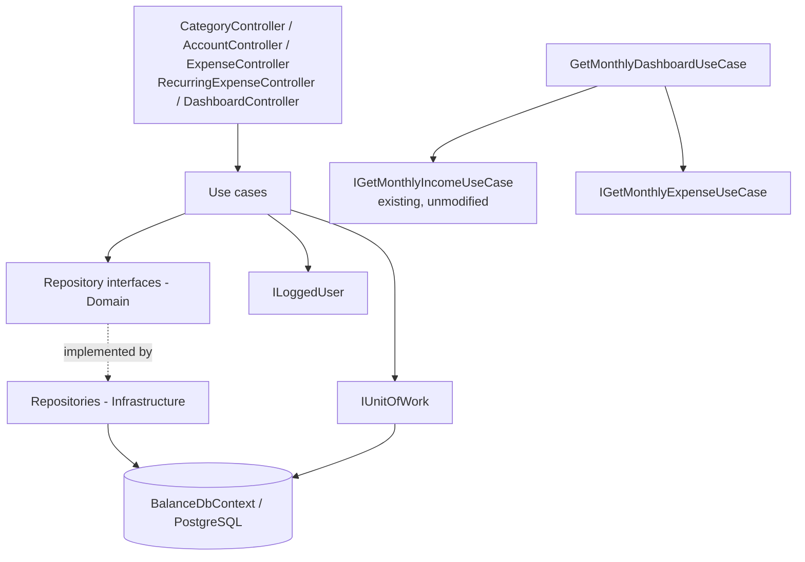
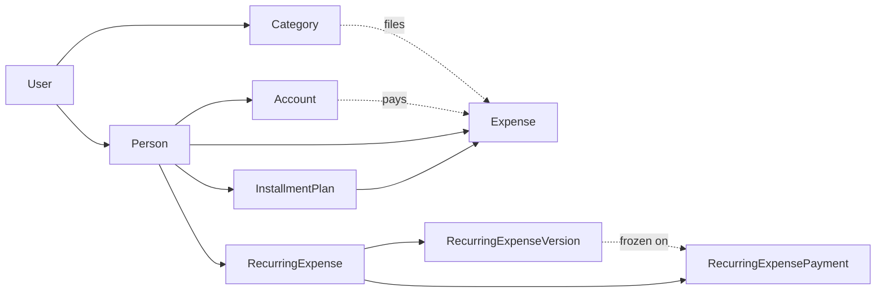

# Expense Tracking Design

**Spec**: `.specs/features/expense-tracking/spec.md`
**Context**: `.specs/features/expense-tracking/context.md`
**Status**: Proposed

---

## Approach exploration

Two decisions carried real alternatives. Both are recorded rather than assumed.

### How the monthly expense view is produced

| Approach | How it works | Verdict |
| -------- | ------------ | ------- |
| **A. Projection on read (chosen)** | `GetMonthlyExpense` loads the month's expenses and the non-archived recurring expenses with their versions and that month's payment, and reconciles in memory. | **Chosen.** Identical to the income view, so one mental model covers both halves. No scheduler, no write amplification, and a retroactive version correction cannot leave a stale month behind. |
| B. Materialised month rows | A row per recurring expense per month written ahead of time. | Rejected. Needs a scheduler the solution does not have, and the user explicitly wants the estimate to be recomputed, not frozen, until a payment overrides it. |
| C. SQL view | The database computes the reconciliation. | Rejected for the same reason as income: it splits rules between C# and SQL, and the in-memory provider behind `WebApi.Test` cannot host a view. |

### How the "version in effect at a month" rule is shared with income

| Approach | Verdict |
| -------- | ------- |
| Extract an `IValidityPeriod` interface, make `IncomeSourceVersion` implement it, and generalise `IncomeSourceExtensions.VersionInEffect` | **Rejected.** It is the better factoring in the abstract, but it edits a method that 82 passing tests depend on, and the user's standing constraint is that income logic is not modified. The refactor buys eight saved lines at the cost of touching the one thing that must not move. |
| **Duplicate the rule as `RecurringExpenseExtensions.VersionInEffect` (chosen)** | **Chosen.** Eight lines of deliberate duplication, in its own file, tested independently. Income is read and reused, never edited. `DateOnly.FirstDayOfMonth()` is *called* from the existing extensions file, which is reuse without modification. |

This is a conscious trade recorded so a future reader does not "fix" it by accident. When income eventually gains its own archive/versioning work, unifying the two is the natural moment.

### Migration strategy

The committed `20260810230958_InitialCreate` describes the income schema and has never been applied to a
database — Docker has been down since it was written. Regenerating it (what income-tracking did) is no
longer justified: the expense schema is purely **additive**, with no primary-key or column-type change
to any existing table. A second migration, `AddExpenseTracking`, is generated on top. Committed
migration history stays intact.

---

## Architecture Overview

A standard vertical slice over the existing Clean Architecture layers, mirroring income. No
cross-cutting change: every new type inherits the `BaseEntity` that already exists.



Ownership, per AD-002 and AD-003, with the split the user chose:



`Category` hangs off `User` directly; everything else cascades through `Person`, so every repository
read filters on either `UserId` or `Person.UserId`. An `Expense` and the `Account` that paid for it may
belong to different People of the same `User` — the two ownership checks are independent and both
resolve to the logged user.

---

## Code Reuse Analysis

### Existing Components to Leverage

| Component | Location | How to Use |
| --------- | -------- | ---------- |
| `BaseEntity` | `src/Balance.Domain/Entities/BaseEntity.cs` | Every new entity inherits it; timestamps are already stamped centrally |
| Audit stamping | `src/Balance.Infrastructure/DataAccess/BalanceDbContext.cs:88` | `StampAuditFields` already walks `ChangeTracker.Entries<BaseEntity>()`; new entities need no work |
| `ILoggedUser` | `src/Balance.Infrastructure/Services/LoggedUser/LoggedUser.cs` | Ownership root for every new query |
| `IUnitOfWork` | `src/Balance.Infrastructure/DataAccess/UnitOfWork.cs` | One `Commit()` per use case gives the transactional guarantees INST-01 and RECR-01 require |
| `ExceptionFilter` | `src/Balance.Api/Filters/ExceptionFilter.cs` | Maps `ErrorOnValidationException` → 400, `NotFoundException` → 404; no try/catch in controllers |
| `ResourceErrorMessages` + `.resx` pair | `src/Balance.Exception/` | New keys added to both files. `NAME_REQUIRED` and `AMOUNT_GREATER_THAN_ZERO` already exist and are reused verbatim |
| `DateOnly.FirstDayOfMonth()` | `src/Balance.Domain/Extensions/IncomeSourceExtensions.cs:7` | Called, not edited |
| `IGetMonthlyIncomeUseCase` | `src/Balance.Application/UseCases/Incomes/GetMonthly/` | Injected into the dashboard use case and invoked as-is |
| Repository read/write split | `src/Balance.Domain/Repositories/Incomes/` | Same interface shape for every new aggregate |
| Validator pattern | `src/Balance.Application/UseCases/Incomes/Register/RegisterIncomeSourceValidator.cs` | FluentValidation `AbstractValidator<TRequest>` per use case |
| Test builders | `tests/CommonTestUtilities/` | New builders follow `IncomeSourceBuilder` and `RequestRegisterIncomeSourceJsonBuilder` |
| `CustomWebApplicationFactory` | `tests/WebApi.Test/CustomWebApplicationFactory.cs` | Extended with expense seed data; the existing income seed is left untouched |

### Integration Points

| System | Integration Method |
| ------ | ------------------ |
| Income | One-way, read-only: the dashboard use case depends on `IGetMonthlyIncomeUseCase`. Nothing in income depends on expenses |
| PostgreSQL | Seven new tables in one additive migration, `AddExpenseTracking` |
| Swagger | New controllers inherit the existing Bearer configuration |
| Frontend (Vite dev server) | Needs a CORS policy in `Program.cs` — the first in the solution. Named policy, `http://localhost:5173` only |

---

## Components

### Enums

- **Location**: `src/Balance.Domain/Enums/` and mirrored in `src/Balance.Communication/Enums/`
- `ExpenseType { Credit = 0, Debit = 1, Pix = 2 }`
- `ExpensePriority { Essential = 0, Important = 1, Superfluous = 2 }`
- `ExpenseStatus { Pending = 0, Paid = 1, Divergent = 2 }`
- **Reuses**: the domain/communication enum pairing already used by `IncomeType` and `IncomeStatus`

### CompetenceMonthResolver

- **Purpose**: One implementation of EXPN-02, used by both the single-expense and the installment-plan use cases, so they cannot drift.
- **Location**: `src/Balance.Domain/Extensions/CompetenceMonthResolver.cs`
- **Interface**: `static DateOnly Resolve(ExpenseType type, int? closingDay, DateOnly date)`
- **Rule**: `Credit` with a non-null `closingDay` and `date.Day > closingDay` → the first day of the month after `date`; every other combination → the first day of `date`'s own month.
- **Dependencies**: none — a pure function, unit-testable without a database

### RecurringExpenseExtensions

- **Purpose**: The version in effect at a competence month (VIEW-03, RPAY-02).
- **Location**: `src/Balance.Domain/Extensions/RecurringExpenseExtensions.cs`
- **Interface**: `static RecurringExpenseVersion? VersionInEffect(this RecurringExpense, DateOnly)`
- **Rule**: greatest `ValidityStart` not after the month's last day, whose `ValidityEnd` is null or not before the month's first day. Null when the month predates every version.
- **Reuses**: `DateOnly.FirstDayOfMonth()`

### Repositories

Interfaces in `src/Balance.Domain/Repositories/`, implementations in
`src/Balance.Infrastructure/DataAccess/Repositories/`. Every read takes the logged `User` (AD-003).

| Interface | Methods |
| --------- | ------- |
| `ICategoryReadOnlyRepository` | `GetAll(User)`, `GetById(User, Guid)` |
| `ICategoryWriteOnlyRepository` | `Add(Category)` |
| `IAccountReadOnlyRepository` | `GetAll(User)`, `GetById(User, Guid)` |
| `IAccountWriteOnlyRepository` | `Add(Account)` |
| `IExpenseReadOnlyRepository` | `GetForMonth(User, DateOnly)` — includes category, account and plan |
| `IExpenseWriteOnlyRepository` | `Add(Expense)`, `AddRange(IEnumerable<Expense>)`, `AddPlan(InstallmentPlan)` |
| `IRecurringExpenseReadOnlyRepository` | `GetById(User, Guid)`, `GetForMonth(User, DateOnly)` — includes versions and that month's payment |
| `IRecurringExpenseWriteOnlyRepository` | `Add(RecurringExpense)`, `AddVersion(RecurringExpenseVersion)` |
| `IRecurringExpenseUpdateOnlyRepository` | `GetById(User, Guid)` — tracked |
| `IRecurringExpensePaymentRepository` | `Add(...)`, `GetById(User, Guid)` tracked, `GetByMonth(Guid, DateOnly)` |

### Use cases

| Use case | Location | Requirement |
| -------- | -------- | ----------- |
| `RegisterCategoryUseCase` | `UseCases/Categories/Register/` | SHAR-01, SHAR-03 |
| `GetAllCategoriesUseCase` | `UseCases/Categories/GetAll/` | SHAR-01 |
| `RegisterAccountUseCase` | `UseCases/Accounts/Register/` | SHAR-02, SHAR-03 |
| `GetAllAccountsUseCase` | `UseCases/Accounts/GetAll/` | SHAR-02 |
| `RegisterExpenseUseCase` | `UseCases/Expenses/Register/` | EXPN-01..03 |
| `RegisterInstallmentPlanUseCase` | `UseCases/Expenses/RegisterInstallmentPlan/` | INST-01..03 |
| `GetMonthlyExpenseUseCase` | `UseCases/Expenses/GetMonthly/` | VIEW-01..04 |
| `RegisterRecurringExpenseUseCase` | `UseCases/RecurringExpenses/Register/` | RECR-01, RECR-02 |
| `ChangeRecurringExpenseValueUseCase` | `UseCases/RecurringExpenses/ChangeValue/` | RECR-03, RECR-04 |
| `ArchiveRecurringExpenseUseCase` | `UseCases/RecurringExpenses/Archive/` | RECR-05 |
| `RegisterRecurringExpensePaymentUseCase` | `UseCases/RecurringExpenses/RegisterPayment/` | RPAY-01, RPAY-03 |
| `UpdateRecurringExpensePaymentUseCase` | `UseCases/RecurringExpenses/UpdatePayment/` | RPAY-02 |
| `GetMonthlyDashboardUseCase` | `UseCases/Dashboard/GetMonthly/` | DASH-01, DASH-02 |

`ArchiveRecurringExpenseUseCase` takes a boolean, so archive and unarchive are one code path with one
ownership check rather than two near-identical files.

### Controllers

| Controller | Routes |
| ---------- | ------ |
| `CategoryController` | `POST /api/category`, `GET /api/category` |
| `AccountController` | `POST /api/account`, `GET /api/account` |
| `ExpenseController` | `POST /api/expense`, `POST /api/expense/installment-plan`, `GET /api/expense/{year:int}/{month:int}` |
| `RecurringExpenseController` | `POST /api/recurring-expense`, `PUT /api/recurring-expense/value`, `PUT /api/recurring-expense/{id:guid}/archive`, `POST /api/recurring-expense/payment`, `PUT /api/recurring-expense/payment/{id:guid}` |
| `DashboardController` | `GET /api/dashboard/{year:int}/{month:int}` |

All `[Authorize]`, all documented with `ProducesResponseType`, matching `IncomeController`.

---

## Data Models

```csharp
enum ExpenseType     { Credit = 0, Debit = 1, Pix = 2 }
enum ExpensePriority { Essential = 0, Important = 1, Superfluous = 2 }
enum ExpenseStatus   { Pending = 0, Paid = 1, Divergent = 2 }

class Category : BaseEntity        { string Name; string? Description;
                                     ExpensePriority Priority;
                                     Guid UserId; User User; }

class Account : BaseEntity         { string Name; string Institution;
                                     int? ClosingDay; int? DueDay; decimal? Limit;
                                     Guid PersonId; Person Person; }

class Expense : BaseEntity         { string Name; ExpenseType Type; decimal Amount;
                                     DateOnly Date; DateOnly CompetenceMonth;
                                     int? InstallmentNumber;
                                     Guid PersonId;   Person Person;
                                     Guid CategoryId; Category Category;
                                     Guid AccountId;  Account Account;
                                     Guid? InstallmentPlanId; InstallmentPlan? InstallmentPlan; }

class InstallmentPlan : BaseEntity { string Name; decimal TotalAmount; int InstallmentCount;
                                     DateOnly StartDate; DateOnly EndDate;
                                     Guid PersonId;   Person Person;
                                     Guid CategoryId; Category Category;
                                     Guid AccountId;  Account Account;
                                     IList<Expense> Installments; }

class RecurringExpense : BaseEntity{ string Name; int DueDay;
                                     bool IsEstimate; bool Archived;
                                     Guid PersonId;   Person Person;
                                     Guid CategoryId; Category Category;
                                     Guid AccountId;  Account Account;
                                     IList<RecurringExpenseVersion> Versions;
                                     IList<RecurringExpensePayment> Payments; }

class RecurringExpenseVersion : BaseEntity { Guid RecurringExpenseId; RecurringExpense RecurringExpense;
                                             decimal Amount;
                                             DateOnly ValidityStart; DateOnly? ValidityEnd;
                                             string ChangeReason; }

class RecurringExpensePayment : BaseEntity { Guid RecurringExpenseId; RecurringExpense RecurringExpense;
                                             Guid RecurringExpenseVersionId; RecurringExpenseVersion Version;
                                             DateOnly ReferenceMonth; DateOnly PaymentDate;
                                             decimal AmountPaid; string? Notes;
                                             Guid? AccountId; Account? Account; }
```

**Mapping decisions**

| Concern | Decision |
| ------- | -------- |
| Money | `decimal` with `HasPrecision(18, 2)` on `Expense.Amount`, `InstallmentPlan.TotalAmount`, `Account.Limit`, `RecurringExpenseVersion.Amount`, `RecurringExpensePayment.AmountPaid` |
| `CompetenceMonth` / `ReferenceMonth` | `DateOnly` normalised to day 1, on write and on query |
| Delete behaviour | `Restrict` on every relationship |
| Indexes | `Category.UserId`; `Account.PersonId`; `Expense (PersonId, CompetenceMonth)`; `Expense.InstallmentPlanId`; `InstallmentPlan.PersonId`; `RecurringExpense.PersonId`; `RecurringExpenseVersion (RecurringExpenseId, ValidityStart)` |
| Uniqueness | Unique index on `RecurringExpensePayment (RecurringExpenseId, ReferenceMonth)` — the spec's one-payment-per-month rule, enforced by the database as well as by the use case |
| Enum storage | `int`, the existing convention |

**Competence-month rule** — one function, two callers:

```
Resolve(type, closingDay, date):
    if type == Credit and closingDay is not null and date.Day > closingDay:
        return first day of (date + 1 month)
    return first day of date's month
```

A purchase *on* the closing day stays in the current month, which is the edge case the spec pins down.

**Installment amounts** — `each = round(total / n, 2)` for 1..n-1; the last is `total - each * (n - 1)`.
For 100.00 over 3 this yields 33.33, 33.33, 33.34. The remainder always lands on the final installment,
so the sum is exact by construction rather than by rounding luck.

**Status resolution** for a recurring line — evaluated in this order so the rules cannot overlap:

1. no payment → `Pending`, actual null
2. expected is null (no version in effect) → `Paid`
3. actual == expected → `Paid`
4. otherwise → `Divergent`

**Committed total** — per recurring line, the actual amount when a payment exists, otherwise the
expected amount; summed with the variable total. This is what "what this month costs me" means when
some bills have arrived and others have not.

---

## Error Handling Strategy

| Error Scenario | Handling | User Impact |
| -------------- | -------- | ----------- |
| Validation failure | `ErrorOnValidationException` from the use case's validator | 400 with `errorMessages` |
| Referenced person, category, account, recurring expense or payment not owned by the caller | Repository returns null → `NotFoundException` | 404, identical to a non-existent id (AD-004) |
| Second payment for the same recurring expense and month | `ErrorOnValidationException` after a `GetByMonth` probe | 400 `PAYMENT_ALREADY_RECORDED` |
| Payment against an archived recurring expense | `ErrorOnValidationException` | 400 `RECURRING_EXPENSE_ARCHIVED` |
| No version in effect at the reference month | `ErrorOnValidationException` | 400 `NO_VERSION_IN_EFFECT` (key already exists) |
| Invalid year/month in a route | `ErrorOnValidationException` | 400 `REFERENCE_MONTH_INVALID` (key already exists) |
| Missing or invalid bearer token | JWT middleware | 401, no body |
| Database unreachable | Existing `ExceptionFilter` fallback | 500 `UNKNOWN_ERROR` |

New message keys: `DAY_OUT_OF_RANGE`, `INSTALLMENT_COUNT_INVALID`, `PAYMENT_ALREADY_RECORDED`,
`RECURRING_EXPENSE_ARCHIVED`, `CATEGORY_NOT_FOUND`, `ACCOUNT_NOT_FOUND`. Reused as-is:
`NAME_REQUIRED`, `AMOUNT_GREATER_THAN_ZERO`, `NO_VERSION_IN_EFFECT`, `CHANGE_REASON_REQUIRED`,
`VALIDITY_START_MUST_BE_LATER`, `REFERENCE_MONTH_INVALID`, `PERSON_NOT_FOUND`.

> **Correction, T18 and T28.** This table originally named `PERSON_NOT_FOUND` as the only reused
> not-found key, which would have answered a foreign *category* with "Person not found" — a 404 with a
> body describing the wrong entity. `CATEGORY_NOT_FOUND`, `ACCOUNT_NOT_FOUND` (T18) and
> `RECURRING_EXPENSE_NOT_FOUND` (T28) were added following the existing `INCOME_SOURCE_NOT_FOUND`
> convention. The 404 status AD-004 pins is unchanged; only the message body names the right entity.
> Recorded as `SPEC_DEVIATION` markers in `RegisterExpenseUseCase.cs` and
> `ChangeRecurringExpenseValueUseCase.cs`.

> **Correction, T26 — response shape.** `ResponseRecurringExpenseJson` carries the **version history as
> a collection**, not just the version currently in effect. Returning only the current version (income's
> shape) leaves RECR-03 AC1 — "sets the `ValidityEnd` of the version in effect to the day before the new
> `ValidityStart`" — unobservable at the endpoint layer, so the change-value route could not be verified
> end to end. With the collection, the response shows the closed version at its exact end date, which is
> what the Independent Tests for RECR-01 and RECR-03 ask a reader to confirm.

> **Implementation note, T27/T28 — EF change-tracker fixup.** After `AddVersion`, the tracker fixes the
> new version into the already-loaded `Versions` collection, so appending it again when building the
> response double-counts it. This surfaced only in the T31 endpoint test (3 versions where 2 were
> expected); the unit test's mocked repository performs no fixup and stayed green. Any use case that
> adds a child to a loaded aggregate must filter by id before appending — this applies directly to the
> payment use cases in Phase 7, which touch the same aggregate.

---

## Delivery: seeding and the frontend page

Neither is API code, so both are recorded here rather than in the components table.

| Piece | Decision |
| ----- | -------- |
| PostgreSQL | Started from the existing `docker-compose.yml`; `DataBaseMigration` applies both migrations on API startup |
| Seeding | A Node script, `frontend/scripts/seed.mjs`, run on the NVM Node 20 binary. It registers a user, logs in, and drives the public API to create people, categories, accounts, income and expenses of every shape. Chosen over an EF seeder because it exercises the real endpoints and adds no production code path that ships to nowhere |
| Frontend | React + Vite in `C:\estudos\projetos\Balance\frontend`, one page. It logs in with the seeded credentials and renders `GET /api/dashboard/{year}/{month}`: fixed income, variable income, fixed (recurring) expenses, variable expenses, and the month balance |
| Node invocation | `%APPDATA%\nvm\v20.19.4\node.exe` directly — `nvm use` needs admin and the system Node is v12 |
| CORS | A named policy in `Program.cs` allowing `http://localhost:5173`. The first CORS configuration in the solution; scoped to the dev origin, not `AllowAnyOrigin` |

---

## Risks & Concerns

| Concern | Location | Impact | Mitigation |
| ------- | -------- | ------ | ---------- |
| The `VersionInEffect` rule now exists twice | `IncomeSourceExtensions.cs` and the new `RecurringExpenseExtensions.cs` | A future fix to one silently misses the other | Deliberate and recorded above; the expense copy gets its own unit tests including an overlapping-versions fixture, which is exactly what lesson **L-001** says a single-match fixture would miss |
| `Expense` and `Account` may belong to different People | `RegisterExpenseUseCase` | A weak check could let a foreign account through | Two independent repository lookups, each filtered on the logged user; an integration test registers an expense for person A on person B's account and a second test proves a *different account's* account 404s |
| Installment rounding | `RegisterInstallmentPlanUseCase` | A cent lost or invented across N rows | The last installment is computed as the residual, never rounded; a unit test asserts the sum equals the total for several awkward totals |
| Unique index on `(RecurringExpenseId, ReferenceMonth)` | `BalanceDbContext` | The EF in-memory provider used by `WebApi.Test` does not enforce unique indexes, so an integration test could pass while PostgreSQL would reject | The rule is enforced in the use case with an explicit `GetByMonth` probe and unit-tested there; the index is defence in depth, not the primary guard |
| `.Include(expense => expense.Versions)` with no ordering | `RecurringExpenseRepository` | Same root cause as the row above, different shape: EF Core's `Include` gives no ordering guarantee for a child collection, and the in-memory provider happened to preserve insertion order (oldest-first) - real PostgreSQL did not, returning newest-first instead. Every consumer, mobile and backend test alike, had assumed "oldest first" as if it were guaranteed. Found live, against a real seeded database, in the mobile app's final manual verification (T48): a re-priced bill displayed its superseded amount, not its current one | Fixed at the source with `.Include(expense => expense.Versions.OrderBy(version => version.ValidityStart))` on all four query methods in `RecurringExpenseRepository`, so "oldest first" is now an actual guarantee rather than an accident of one provider. No existing test's assertion flipped - every hand-built in-memory fixture already assumed the now-guaranteed order, which is exactly why the bug was invisible to the suite. This is the same category of gap as the row above, and the same lesson: the in-memory provider proves logic, not real database behaviour - ordering, like uniqueness, has to be checked against Postgres to be trusted |
| First CORS policy in the solution | `Program.cs` | A permissive policy would outlive the demo | Named policy, single explicit origin, no `AllowAnyOrigin` |
| Docker is down at design time | environment | Nothing can be seeded and the page has no data | The user is starting Docker Desktop; every phase before the seed phase is verifiable on the in-memory provider, so only the final phase is blocked |
| System Node is v12.6.0 | environment | `npm create vite` fails outright | Node 20.19.4 invoked by absolute path from the NVM directory; verified working with npm 10.8.2 |
| 82 existing tests must stay green and unedited | `tests/` | An accidental edit to an income type would breach the user's constraint | No task touches an income file; the full suite is the gate on every task, so a breach fails immediately |

---

## Tech Decisions

| Decision | Choice | Rationale |
| -------- | ------ | --------- |
| Category ownership | `UserId` directly | The user's decision: one category serves every Person of the account |
| Account ownership | `PersonId` | The user's decision: each person has their own cards |
| Competence month | Derived in a pure static function, overridable per request | One rule, two callers, no database needed to test it |
| Installment generation | In the use case, one `Commit()` | The transactional guarantee INST-01 requires, with no new infrastructure |
| Version rule sharing | Duplicated, not extracted | Income must not be edited; the trade is recorded above |
| Archive | Soft flag with a dedicated operation | Preserves payment history, and closes the gap lesson L-002 recorded |
| Payment uniqueness | Use-case probe plus a unique index | The in-memory test provider ignores the index |
| Dashboard | Composition of two use cases | Zero coupling into income beyond its public interface |
| Migration | Additive `AddExpenseTracking` | The expense schema changes no existing column; committed history stays intact |
| Seeding | Node script against the live API | Proves the endpoints, ships no dead production code |

> **Project-level decisions** are recorded in `.specs/STATE.md`. This feature proposes `AD-005`
> (ownership may attach to `Person` or to `User`, decided per entity by whether the thing is shared
> across the household) and `AD-006` (income code is read-only for other features; integration is by
> composing its use case interfaces).
