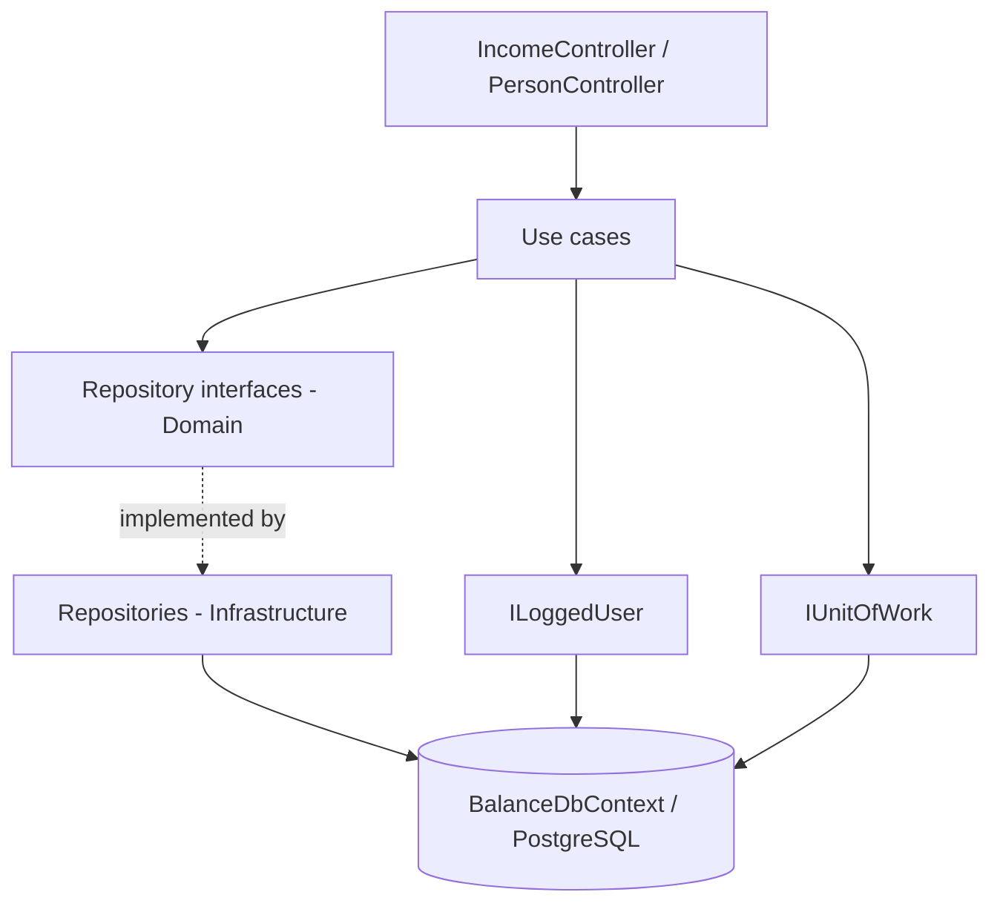
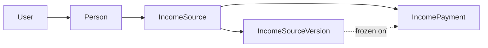

# Income Tracking Design

**Spec**: `.specs/features/income-tracking/spec.md`
**Context**: `.specs/features/income-tracking/context.md`
**Status**: Approved (user delegated execution without further review)

---

## Approach exploration

The spec is Large/Complex, so the process calls for presenting alternatives before committing. The user
delegated the run without further questions, so the alternatives and the choice are recorded here
instead of being put to a vote.

| Approach | How the monthly view works | Verdict |
| -------- | -------------------------- | ------- |
| **A. Projection on read (chosen)** | Nothing is written per month. `GetMonthlyIncome` loads the non-archived sources with their versions and that month's payments, and reconciles in memory. | **Chosen.** No background job, no write amplification, no stale rows when a version is corrected retroactively. The data volume is a household's income sources - tens of rows, not millions. |
| B. Materialised month rows | A row per source per month is written ahead of time and updated as payments arrive. | Rejected. Requires a scheduler the solution does not have, and a retroactive version fix would leave months silently wrong. |
| C. SQL view / raw query | A database view computes the reconciliation. | Rejected. Splits business rules between C# and SQL, and the in-memory provider used by `WebApi.Test` cannot host a view, so the integration tests would lose their only execution path. |

---

## Architecture Overview

The feature is a standard vertical slice over the existing Clean Architecture layers. The only
cross-cutting change is `BaseEntity`, which lands in Domain and is adopted by every persisted type
including the existing `User`.



Ownership is enforced in the repository layer, not the controller: every read method takes the logged
`User` and filters on `Person.UserId`, so a use case cannot accidentally return another account's rows.



---

## Code Reuse Analysis

### Existing Components to Leverage

| Component | Location | How to Use |
| --------- | -------- | ---------- |
| `ILoggedUser` / `LoggedUser` | `src/Balance.Infrastructure/Services/LoggedUser/LoggedUser.cs` | Already built and currently unused; becomes the ownership root for every query |
| `IUnitOfWork` / `UnitOfWork` | `src/Balance.Infrastructure/DataAccess/UnitOfWork.cs` | Single `Commit()` per use case gives the transactional guarantees the spec requires |
| `ExceptionFilter` | `src/Balance.Api/Filters/ExceptionFilter.cs` | Maps `ErrorOnValidationException` to 400 and `NotFoundException` to 404; no try/catch in controllers |
| `ResourceErrorMessages` + `.resx` pair | `src/Balance.Exception/` | New message keys are added to both files plus one property each |
| Read/write repository split | `src/Balance.Domain/Repositories/Users/` | Same two-interface shape for People and income |
| Validator pattern | `src/Balance.Application/UseCases/Users/Register/RegisterUserValidator.cs` | FluentValidation `AbstractValidator<TRequest>` per use case |
| `BalanceClassFixture` | `tests/WebApi.Test/BalanceClassFixture.cs` | Already supports a bearer token and a culture per request |
| `CustomWebApplicationFactory` | `tests/WebApi.Test/CustomWebApplicationFactory.cs` | Already seeds two users and exposes their tokens |

### Integration Points

| System | Integration Method |
| ------ | ------------------ |
| Existing auth | The new endpoints are the first `[Authorize]` endpoints; the JWT pipeline is already registered in `Program.cs` |
| PostgreSQL | Four new tables plus a rebuilt `Users` table, in one regenerated `InitialCreate` migration |
| Swagger | Already Bearer-aware from the auth module; new endpoints inherit the Authorize button |

---

## Components

### BaseEntity

- **Purpose**: One identity and audit shape for every persisted entity.
- **Location**: `src/Balance.Domain/Entities/BaseEntity.cs`
- **Interfaces**: `Guid Id`, `DateTime CreatedAt`, `DateTime? UpdatedAt`
- **Dependencies**: none
- **Reuses**: nothing - this is the new root

### Timestamp stamping

- **Purpose**: Fill `CreatedAt` / `UpdatedAt` without every use case remembering to.
- **Location**: `src/Balance.Infrastructure/DataAccess/BalanceDbContext.cs` (override `SaveChangesAsync` and `SaveChanges`)
- **Interfaces**: walks `ChangeTracker.Entries<BaseEntity>()`; `Added` sets `CreatedAt`, `Modified` sets `UpdatedAt`
- **Dependencies**: EF Core change tracker
- **Reuses**: the existing `BalanceDbContext`

### Income repositories

- **Purpose**: All persistence for the feature, with ownership baked into every read.
- **Location**: interfaces in `src/Balance.Domain/Repositories/`, implementations in `src/Balance.Infrastructure/DataAccess/Repositories/`
- **Interfaces**:
  - `IPersonReadOnlyRepository.GetAll(User)`, `.GetById(User, Guid)`
  - `IPersonWriteOnlyRepository.Add(Person)`
  - `IIncomeSourceReadOnlyRepository.GetById(User, Guid)` - includes versions
  - `IIncomeSourceReadOnlyRepository.GetForMonth(User, DateOnly)` - includes versions and that month's payments
  - `IIncomeSourceWriteOnlyRepository.Add(IncomeSource)`, `.AddVersion(IncomeSourceVersion)`
  - `IIncomePaymentWriteOnlyRepository.Add(IncomePayment)`
- **Dependencies**: `BalanceDbContext`
- **Reuses**: the `UserRepository` shape

### Use cases

| Use case | Location | Requirement |
| -------- | -------- | ----------- |
| `RegisterPersonUseCase` | `src/Balance.Application/UseCases/People/Register/` | PRSN-02 |
| `GetAllPeopleUseCase` | `src/Balance.Application/UseCases/People/GetAll/` | PRSN-03 |
| `RegisterIncomeSourceUseCase` | `src/Balance.Application/UseCases/Incomes/Register/` | INC-01..03 |
| `RegisterIncomePaymentUseCase` | `src/Balance.Application/UseCases/Incomes/RegisterPayment/` | INC-04..06 |
| `GetMonthlyIncomeUseCase` | `src/Balance.Application/UseCases/Incomes/GetMonthly/` | INC-07..10 |
| `ChangeIncomeSourceValueUseCase` | `src/Balance.Application/UseCases/Incomes/ChangeValue/` | INC-11..13 |

---

## Data Models

```csharp
abstract class BaseEntity          { Guid Id; DateTime CreatedAt; DateTime? UpdatedAt; }

class User : BaseEntity            { string Name; string Email; string Password; string Role; }

class Person : BaseEntity          { string Name; string? Description;
                                     Guid UserId; User User; bool IsAccountOwner; }

class IncomeSource : BaseEntity    { string Name; IncomeType Type; bool Archived;
                                     Guid PersonId; Person Person;
                                     IList<IncomeSourceVersion> Versions;
                                     IList<IncomePayment> Payments; }

class IncomeSourceVersion : BaseEntity { Guid IncomeSourceId; IncomeSource IncomeSource;
                                         decimal Amount; int ExpectedDay;
                                         DateOnly ValidityStart; DateOnly? ValidityEnd;
                                         string ChangeReason; }

class IncomePayment : BaseEntity   { Guid IncomeSourceId; IncomeSource IncomeSource;
                                     Guid? IncomeSourceVersionId; IncomeSourceVersion? Version;
                                     DateOnly PaymentDate; DateOnly ReferenceMonth;
                                     decimal AmountReceived; string? Notes; }

enum IncomeType   { Recurring = 0, Variable = 1 }
enum IncomeStatus { Pending = 0, Received = 1, Divergent = 2 }
```

**Mapping decisions**

| Concern | Decision |
| ------- | -------- |
| Money | `decimal` with `HasPrecision(18, 2)` → `numeric(18,2)` |
| `ReferenceMonth` | `DateOnly` normalised to day 1 of the month, both on write and on query |
| Delete behaviour | `Restrict` on every relationship; nothing cascades away silently |
| Indexes | `Person.UserId`; `IncomeSource.PersonId`; `IncomePayment (IncomeSourceId, ReferenceMonth)` |
| `User.Email` | keeps its existing unique index |

**Version in effect at a reference month** - one rule, used by both the payment use case and the
monthly view: the version with the greatest `ValidityStart` that is not after the last day of the
month, and whose `ValidityEnd` is null or not before the first day of the month. This picks the most
recent version overlapping the month, so a mid-month raise takes effect that month, and a month that
predates every version resolves to none.

**Status resolution** - evaluated in this order, so the rules cannot overlap:

1. received == 0 → `Pending`
2. expected is null (Variable) → `Received`
3. received == expected → `Received`
4. otherwise → `Divergent`

---

## Error Handling Strategy

| Error Scenario | Handling | User Impact |
| -------------- | -------- | ----------- |
| Validation failure | `ErrorOnValidationException` from the validator | 400 with `errorMessages` |
| Person or source not owned by the caller | Repository returns null → `NotFoundException` | 404, identical to a non-existent id, so ids cannot be probed |
| Archived source receiving a payment | `ErrorOnValidationException` | 400 `INCOME_SOURCE_ARCHIVED` |
| No version in effect for the reference month | `ErrorOnValidationException` | 400 `NO_VERSION_IN_EFFECT` |
| Missing or invalid bearer token | JWT middleware | 401, no body |
| Database unreachable | Existing `ExceptionFilter` fallback | 500 `UNKNOWN_ERROR` |

---

## Risks & Concerns

| Concern | Location | Impact | Mitigation |
| ------- | -------- | ------ | ---------- |
| Changing `User`'s primary key breaks five passing auth tests | `tests/WebApi.Test/CustomWebApplicationFactory.cs:60`, `tests/CommonTestUtilities/Entities/UserBuilder.cs:12` | Green tests turn red mid-run | Phase 1 updates both builders in the same phase as the entity change; the phase's build gate re-runs all five |
| `InitialCreate` is already committed and describes a `bigint` Users PK | `src/Balance.Infrastructure/Migrations/20260810210136_InitialCreate.cs` | A second migration would try to alter a primary key type | No database has ever been created from it (Docker is not running), so the migration is deleted and regenerated as one clean `InitialCreate` |
| `GetForMonth` can become an N+1 if versions and payments are lazily walked | new `IncomeSourceRepository` | Query count grows per source | Explicit `Include` with a filtered `Include` on payments; lazy loading is not enabled in this project |
| No endpoint in the solution has ever been authorised, so the `[Authorize]` path is untested | `src/Balance.Api/Program.cs:75` | An auth misconfiguration would only surface in production | Every new endpoint gets an explicit 401-without-token integration test |
| `ILoggedUser` had zero consumers until now | `src/Balance.Infrastructure/Services/LoggedUser/LoggedUser.cs` | Its token parsing has never run in a test | Phase 1 adds coverage through the first authorised endpoint |
| The `Directory.Build.targets` pin masks the real .NET 10.0.9 runtime | `Directory.Build.targets` | The suite is verified against 10.0.8, not what CI would use | Out of this feature's scope; already reported to the user and gitignored |

---

## Tech Decisions

| Decision | Choice | Rationale |
| -------- | ------ | --------- |
| Where timestamps are stamped | `SaveChangesAsync` override on the DbContext | One place; a use case cannot forget it |
| Where ownership is enforced | Repository read methods take `User` | Makes bypassing it require deleting a parameter, not just forgetting a `Where` |
| Version freeze on payment | Nullable FK resolved at write time | Correcting a validity date later cannot rewrite recorded history |
| Monthly reconciliation | In memory, in the use case | Keeps the rule testable without a database and out of SQL |
| One migration, regenerated | Delete `InitialCreate`, generate one covering all five tables | No database exists yet; two migrations would encode a PK type change that never has to happen |
| Enum storage | `int` | Default EF Core behaviour; no string parsing at the boundary |

> **Project-level decisions** are recorded in `.specs/STATE.md` as `AD-001` through `AD-004`.
